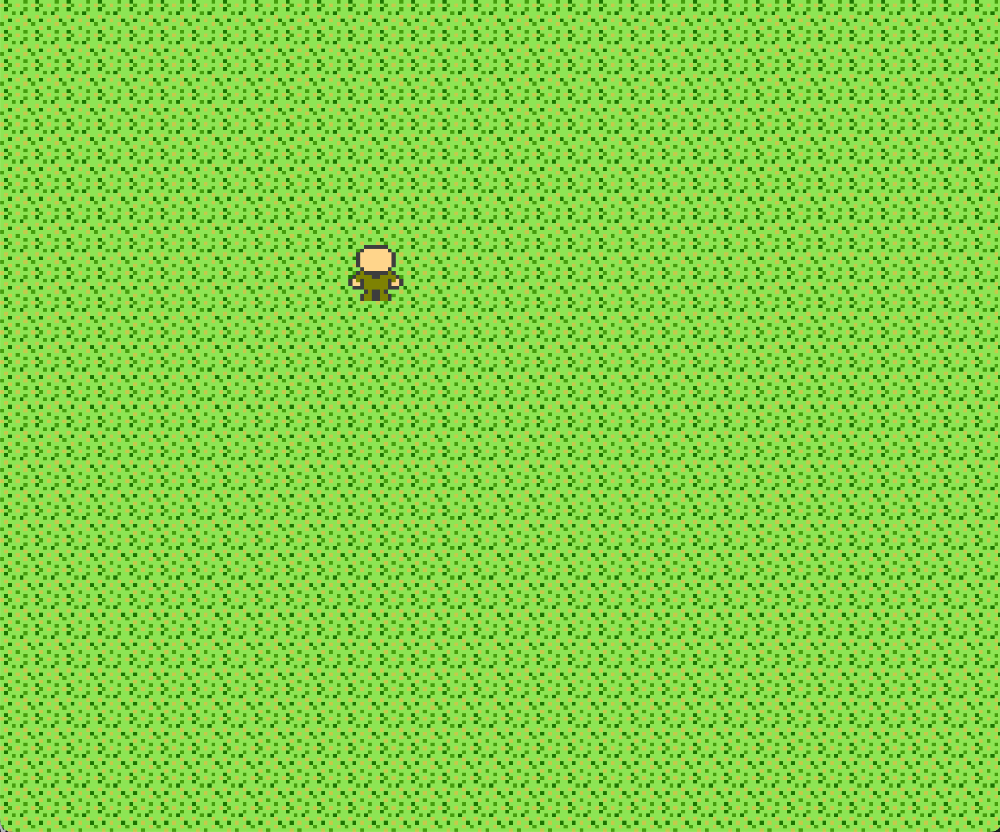

# Jogo para NES

Feito em assembly de 6502 e o compilador cc65.

O jogo é apenas um personagem que se move, fiz como exercício para aprender os básicos de assembly, foi até que bem divertido.

Esteja livre para usar como quiser esse código, mas lembre-se de que ele é GPLv3.

## Como compilar

Para compilar, instale o `make` e o `cc65`.

Para instalar o cc65, você pode compilar pelo código-fonte (muito fácil, nenhuma dependência exceto o compilador C) ou instalar pelo gerenciador de pacotes.

Depois é só rodar `make` e usar seu emulador de NES preferido.